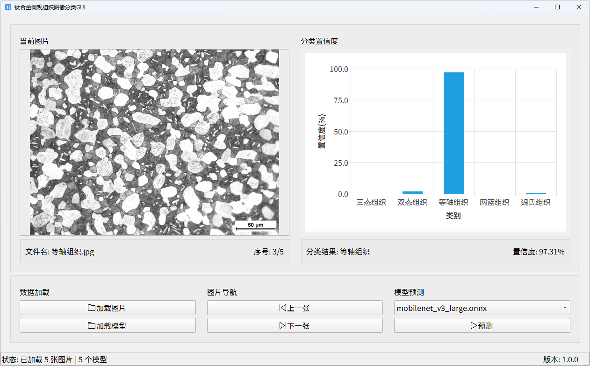

# MicroTiClassifierGUI

MicroTiClassifierGUI 是基于 PySide6 开发的图像分类 GUI。

## 界面预览



## 快速开始

1. 克隆

```bash
git clone https://github.com/huang2fire/MicroTiClassifierGUI.git
```

2. 配置环境

> 安装 [uv](https://github.com/astral-sh/uv)

```bash
cd ./MicroTiClassifierGUI
uv sync
```

3. 运行

```bash
uv run main.py
```

## 许可证

本项目采用 MIT 许可证，详见 [LICENSE](LICENSE) 文件。
